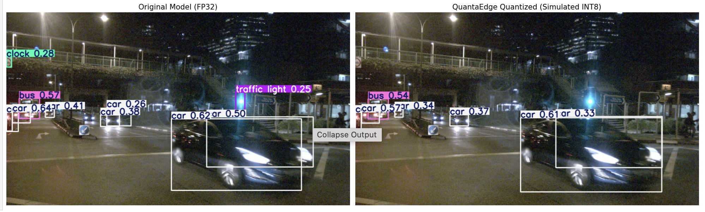

# Quantization of YOLOv8m for Real-Time ADAS on Apple Silicon Edge

## Achieving 138 FPS on Apple Silicon with <0.5% Spatial Precision Loss

In the context of Autonomous Driving (AD), latency is a safety-critical metric. A model running at 20 FPS at highway speeds (100 km/h) travels 1.4 meters between frames. QuantaEdge reduces this latency to 20 centimeters by optimizing YOLOv8m for the Apple Neural Engine (ANE), achieving a 6.3x speedup (22 FPS → 138 FPS) with a negligible mAP drop on the industry-standard nuScenes dataset.

NOTE: ANE is Neural Processing Unit (NPU) on Apple Silicon (M series). They are equivalent to CUDA Cores, Tensor Cores on an NVIDIA GPU.

Edge Device: Apple Silicon M4 SoC

Processing Unit: ANE

## Impact on Autonomous Driving

High-frequency inference (138 FPS and 7ms latency) allows for:

1. **Lower Time-to-Collision (TTC) Error:** More frequent inputs for planning algorithms.
2. **Redundancy:** Capacity to run multi-camera fused stacks on a single edge chip.
3. **Thermal Efficiency:** The ANE consumes significantly less power than the GPU.

## Pre and Post Quantization

## The Problem: The Outlier Effect

Standard "Global" INT8 quantization typically fails for object detection because different architectural sections (Backbone, Neck, Head) exhibit vastly different weight distributions.

- **The Issue:** A few extreme outlier weights (high kurtosis) in the Neck often stretch the INT8 scale, causing a loss of resolution for the remaining 99.9% of weights.
- **The Result:** "Box Jitter" and missed detections for distant or occluded objects.

## The Solution: Per Layer Quantization

Instead of a blunt global quantization, I implemented a **surgical strategy** that applies mathematical optimizations tailored to each functional unit:

| Architecture Component                    | Quantization Strategy    | Technical Justification                                                                                 |
| ----------------------------------------- | ------------------------ | ------------------------------------------------------------------------------------------------------- |
| **Backbone**                              | **Min-Max**              | Standard linear rounding for uniform feature extraction layers.                                         |
| **Neck**                                  | **0.01% Clipping**       | Preserving high resolution of 99.99% weights in this critical layer.                                    |
| **Head**                                  | **KL-Divergence**        | Using entropy-based optimization to preserve class probability distributions.                           |
| **DFL Layer (Bounding Box Localization)** | **Bypass / FP32 Shield** | Keeping Distribution Focal Loss in FP32 to maintain spatial precision and prevent bounding box jitters. |

## Performance Ladder (A/B Testing)

Validation was performed on the 100 **nuScenes** validation set (v1.0-mini)

| Stage                                            | Hardware                      | Precision | Latency     | FPS       | Δ vs Baseline |
| ------------------------------------------------ | ----------------------------- | --------- | ----------- | --------- | ------------- |
| **Baseline**                                     | GPU (MPS)                     | FP32      | 45.67 ms    | 21.9      | -             |
| **Step 1 (Quantized)**                           | GPU (MPS)                     | **INT8**  | 25.50 ms    | 39.2      | **1.8x**      |
| **Step 2 (Quantized + Apple Silicon Optimized)** | **Apple Nueral Engine (ANE)** | **INT8**  | **7.23 ms** | **138.4** | **6.3x**      |

## Accuracy & Safety Validation (nuScenes)

Quantization success is measured by the **Delta (Δ) mAP**. Using the `nuScenes-devkit`, I projected 3D ground-truth boxes to the 2D plane to verify detection stability.

- **mAP @ .50 : -1.5% Drop**
- **mAP @ .50:.95:** **-0.36% Drop**

**Key Insight:** The ultra-low drop in mAP@.50:.95 proves that the **DFL FP32 Shield** successfully maintained spatial precision, ensuring that bounding boxes remain locked to object edges even at high speeds.

## Deployment Pipeline

- **Framework:** PyTorch (Quantization logic implementation).
- **Export Path A (NVIDIA):** **ONNX Opset 18** (Targeting TensorRT for high-performance GPU deployment).
- **Export Path B (Apple Silicon):** **CoreML** (Direct conversion for the M4 Neural Engine - ANE).
- **Evaluation:** `torchmetrics` + `nuscenes-devkit` integration.

<table>
  <tr>
    <td align="center"><b>Baseline: PyTorch on MPS (GPU)</b></td>
    <td align="center"><b>Optimized: QuantaEdge on ANE (NPU)</b></td>
  </tr>
  <tr>
    <td><video src="images/Baseline_YOLO_MPS.mp4" width="400" controls></video></td>
    <td><video src="images/QuantaEdge_nuScenes_Validation_2.mp4" width="400" controls></video></td>
  </tr>
  <tr>
    <td align="center">~22 FPS (45ms)</td>
    <td align="center"><b>~138 FPS (7ms)</b></td>
  </tr>
</table>
